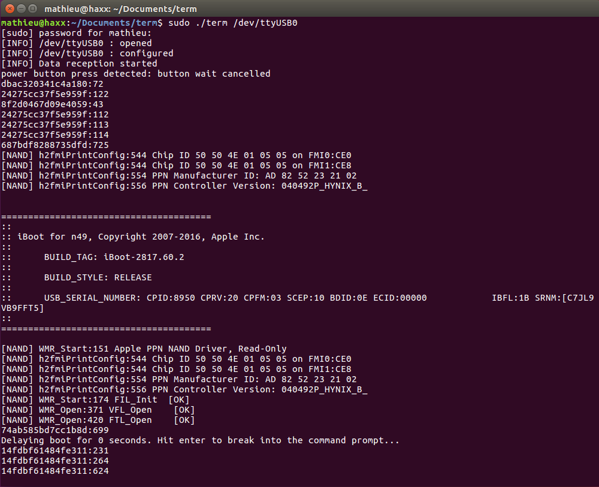

# term
A serial terminal

I've been using termz by the jailbreak pornstar hacker [qwertyoruiop](https://twitter.com/qwertyoruiopz) since this summer but it seems to have some [issues](https://github.com/kpwn/termz/issues/1) I did not managed to fix.  
I decided to make one.  

I tested it on Ubuntu 16.04. No initial support for macOS. Use termz 
### Compilation
Just run `make` you need to have `gcc` installed

### Running term

Usage of term is pretty easy.
eg : `./term /dev/ttyUSB0`.  
Here is the output you may have with an iOS device and dcsd

Actually [baudrate](https://github.com/matteyeux/term/blob/master/term.c#L62) is 115200.
### Creditz
To make this one I used the termios lib.   
Also used as example [termz](https://github.com/kpwn/termz) and the awesome French book about [Linux System Programming](https://www.amazon.fr/gp/product/2212142072/ref=as_li_tl?ie=UTF8&camp=1642&creative=6746&creativeASIN=2212142072&linkCode=as2&tag=chbl-21) by Christophe Blaess
